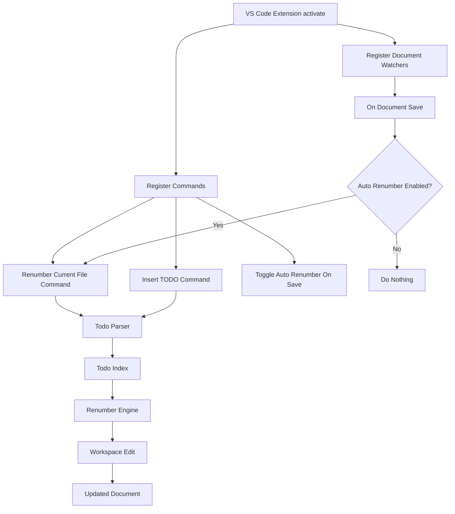

# VS Code Extension Plan: Numbered TODO Tracker

## Goal

Create a VS Code extension that automatically tracks numbered TODO comments and helps keep their numbers sequential.

Example:

```ts
// TODO #1: Set up auth
// TODO #2: Add validation
// TODO #3: Write tests
```

If `TODO #2` is removed, the extension can automatically renumber:

```ts
// TODO #1: Set up auth
// TODO #2: Write tests
```

## MVP Scope

Start simple:

1. Track TODOs in the active file only.
2. Support common TODO formats:

   * `TODO #1: text`
   * `// TODO #1: text`
   * `# TODO #1: text`
   * `<!-- TODO #1: text -->`
3. Add commands:

   * `Todo Numbers: Renumber Current File`
   * `Todo Numbers: Insert TODO After Current`
   * `Todo Numbers: Toggle Auto Renumber On Save`
4. Renumber only on command or on save.
5. Avoid automatic renumbering while the user is typing.

## Core Behavior

### Renumber current file

The extension scans the current file from top to bottom.

Before:

```ts
// TODO #1: Setup API
// TODO #3: Add tests
// TODO #5: Clean up
```

After:

```ts
// TODO #1: Setup API
// TODO #2: Add tests
// TODO #3: Clean up
```

### Insert TODO and shift numbers

If the cursor is after `TODO #2`, inserting a new TODO creates:

```ts
// TODO #1: Setup API
// TODO #2: Add validation
// TODO #3: New TODO
// TODO #4: Add tests
```

### Optional pinned TODOs

Allow TODOs to opt out of renumbering:

```ts
// TODO #99 [pin]: Do not renumber this
```

Pinned TODOs are detected but skipped by the renumbering engine.

## Architecture



## Internal Modules

```txt
src/
  extension.ts
  parser/
    todoParser.ts
  core/
    todoIndex.ts
    renumberEngine.ts
  commands/
    renumberCurrentFile.ts
    insertTodo.ts
  config/
    settings.ts
```

## Main Components

### `todoParser.ts`

Responsible for finding TODO lines.

Regex idea:

```ts
/TODO\s+#(\d+)(\s+\[pin\])?:\s*(.*)/g
```

Returns:

```ts
type TodoItem = {
  line: number;
  start: number;
  end: number;
  number: number;
  text: string;
  pinned: boolean;
};
```

### `renumberEngine.ts`

Responsible for deciding what numbers should change.

Input:

```ts
[
  { line: 2, number: 1 },
  { line: 5, number: 3 },
  { line: 9, number: 5 }
]
```

Output:

```ts
[
  { line: 5, oldNumber: 3, newNumber: 2 },
  { line: 9, oldNumber: 5, newNumber: 3 }
]
```

### `renumberCurrentFile.ts`

Responsible for applying edits to the current document.

It should only replace the number part, not the whole TODO line.

Before:

```ts
// TODO #5: Clean up
```

Only replace:

```txt
5 → 3
```

## VS Code Settings

```json
{
  "todoNumbers.autoRenumberOnSave": false,
  "todoNumbers.scope": "file",
  "todoNumbers.todoPattern": "TODO\\s+#(\\d+)(\\s+\\[pin\\])?:"
}
```

## MVP Implementation Steps

1. Scaffold a TypeScript VS Code extension.
2. Add a command: `Todo Numbers: Renumber Current File`.
3. Parse the active document for numbered TODOs.
4. Compute the correct sequential numbers.
5. Apply edits using VS Code workspace edits.
6. Add config for auto-renumber-on-save.
7. Add an insert TODO command.
8. Add pinned TODO support.
9. Add tests for parser and renumbering logic.
10. Publish privately or package as `.vsix`.

## Recommended First Version

Do not build a sidebar yet.

The first useful version should only do this:

* detect numbered TODOs
* renumber the current file
* optionally renumber on save
* insert a TODO and shift following TODOs

A sidebar, tree view, workspace-wide TODO database, and cross-file numbering can come later.
